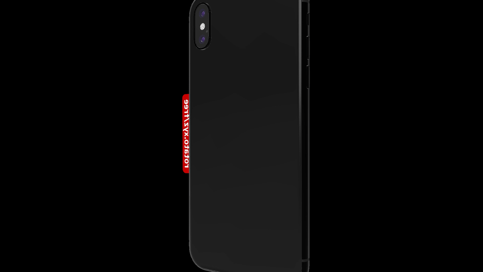
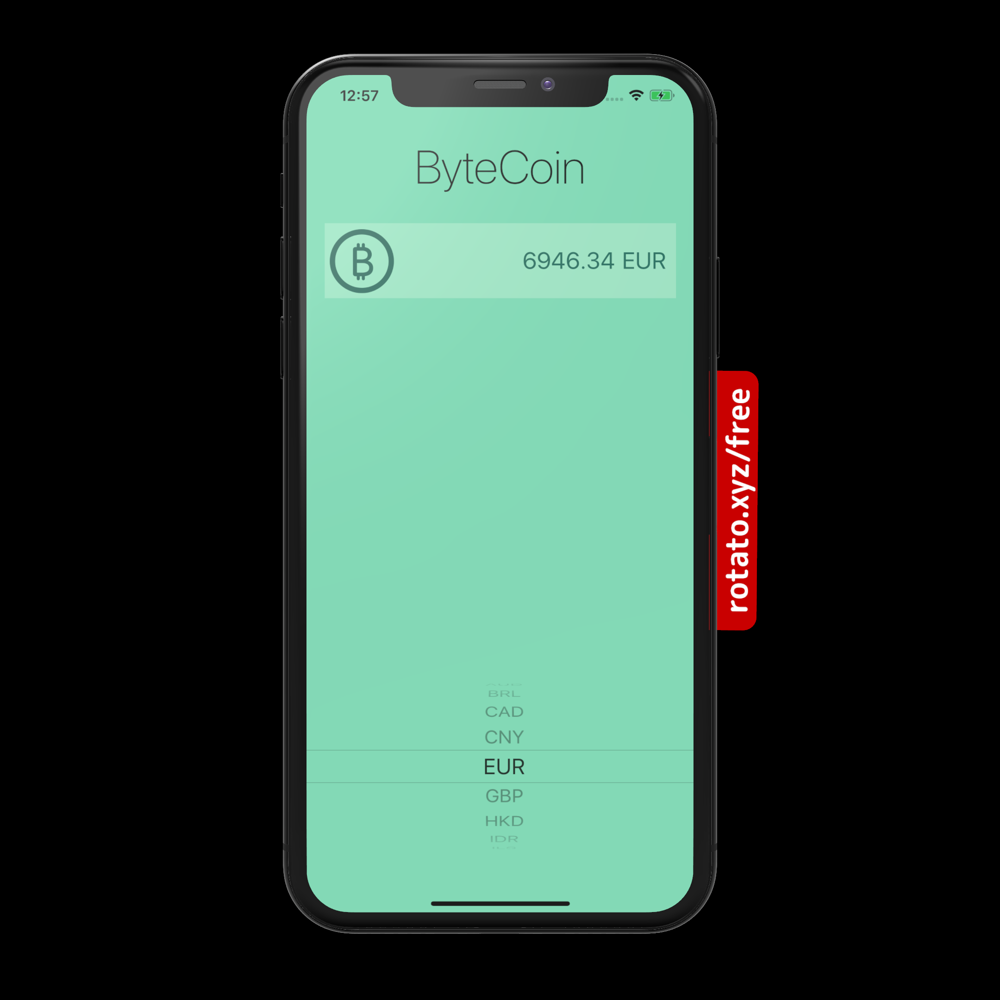
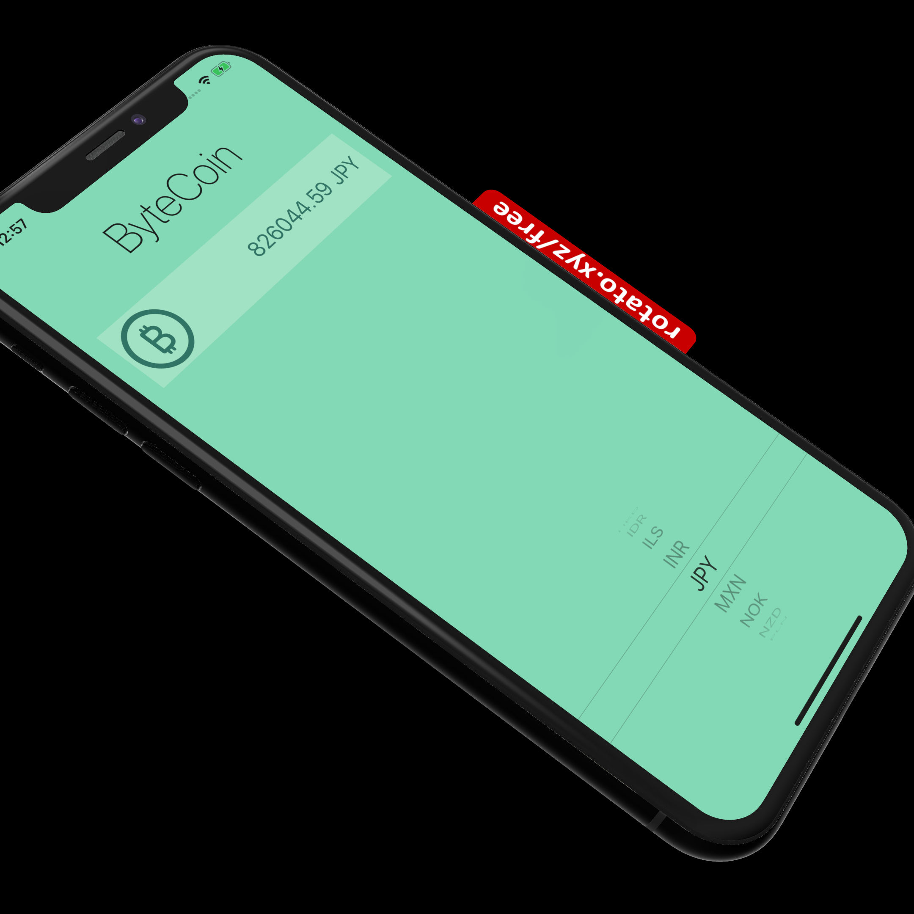

# ByteCoin

> Get latest Bitcoin Price

[](http://cocoapods.org/pods/LFAlertController)
[](http://makeapullrequest.com)

## Screenshot 



 |
 |

## Requirements
- Need an API Key from https://www.coinapi.io
- iOS 9.0+
- Xcode 11

## Installation

#### Manually
1. Clone and open ```ByteCoin.xcodeproj``` in your project.
2. Add your API Key in ```ByteCoin/Model/CoinManager.swift```
3. Congratulations! 

## About Me

Aayush Pareek – [@MyTwitter](https://twitter.com/Aayush79480626)
